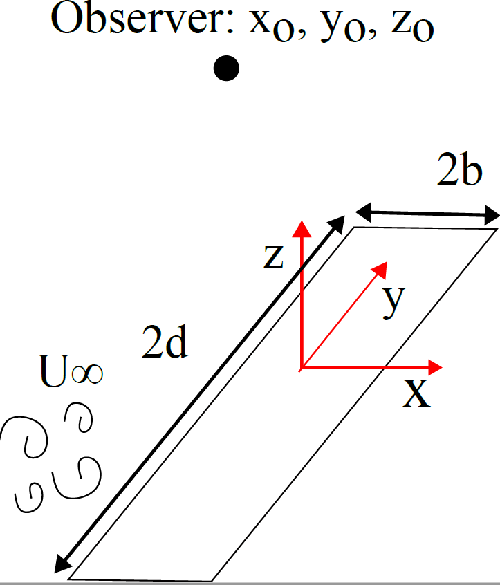
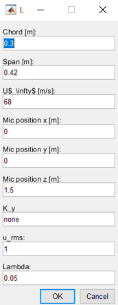
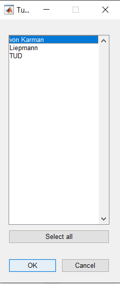

# Amiet_theory_Leading_edge_noise
## Description:

This code predicts leading-edge noise for airfoils using Amiet's theory. Both, the approximation of far-field noise (recommended for aspect ratio larger than 3) and the sincardinal formulation are implemented.

## What is needed to run the code

This code is ready to use in a matlab for windows, specifically for the 2019 version. For running the code in linux or other operational systems, changes in the scripts migth be conducted accordinly.

## Leading-edge noise prediction method
This code is based on Amiet's theory [1]. The aeroacoustics transfer function is modeled for subcritial and supercritical gusts considering also the backscattering effect of the leading edge proposed by Bresciani et al. [2]. 

The reference system is x located in the chordwise direction, y in the spanwise direction and z perpendicular to the wall. The origin of coordinates is located at the midchord at the midspan, as shown: 

The far-field approximation is implemented when the input is defined as k_y = 0. Otherwise, the sincardinal formulation shown by Roger and Moreau is used [3]. 

The wall-pressure spectrum can be calculated using any of the following methods:
1. von Kármán model [4]
2. Liepmann model [5]
3. turbulence distortion (TUD) [6]

The dissipation range can be corrected using the following methods:
1. roger and Moreau [7]
2. dos Santos, F., Botero-Bolívar, L., et al. [8]

## How to run the code

The user needs to run ``Main_TE_noise_prediction.m``. This will open a dialog box:

The inputs are:
* chord
* Span
* Inflow velocity
* Oberver location coordinate in x
* Observer location coordinate in y
* Observer location coordinate in z
* k_y: this is the maximum wave number in the spanwise direction for integrate in case the sin cardinal formulation is used, if it it equal to 0, the far-field approximation is used. The sincardinal formulation takes much longer than the far-field approximation.
* u_rms is the value of the velocity fluctuations of the inflow turbulence in meters per second 
* Lambda is the turbulence inetegral length scale of the inflow turbulence in meters

Later, the user needs to chose the methodology for calculating the spectrum:

As last, the user needs to select eaither apply a correction or not for the dissipation range of the turbulence spectrum
(correction.PNG "This is a sample image.")

## Associated publication:

The comparison of Amiet's theory with wind tunnel experiments for several airfoils is shown in: L. Botero-Bolívar, F. L. dos Santos, C. H. Venner, and L. D. de Santana. Experimental and predicted leading- and trailing-edge noise of symmetric airfoils under zero mean-loading. In: Applied Acoustics 212 (2023), p. 109579. DOI: 10.1016/j.apacoust.2023.109579.

## References:
[1] Amiet, R., “Acoustic radiation from an airfoil in a turbulent stream,” Journal of Sound and Vibration, Vol. 41, No. 4, 1975, pp. 407–420. https://doi.org/10.1016/S0022-460X(75)80105-2.
[2] Bresciani, A. P., Le Bras, S., and de Santana, L. D., “Generalization of Amiet’s theory for small reduced-frequency and nearly-critical gusts,” Journal of sound and vibration, Vol. 524, 2022, p. 116742. https://doi.org/10.1016/j.jsv.2021.116742.
[3] Roger and Moreau. "Extensions and limitations of analytical
airfoil broadband noise models". International Journal of Aeroacoustics, volume 9 · number 3, 2010.
[4] von Kármán, T., “Progress in the Statistical Theory of Turbulence,” Proceedings of the National Academy of Sciences, Vol. 34, No. 11, 1948, pp. 530–539. https://doi.org/10.1073/pnas.34.11.530.
[5] H. W. LIEPMANN 1955 Journal of Aeronautical Sciences 22, 197-200. Extension of the statistical approach to buffeting and gust response of wings of finite span.
[6] de Santana, L., “Semi-analytical methodologies for airfoil noise prediction,” Ph.D. thesis, KU Leuven, 2015
[7] Roger, M., “On broadband jet–ring interaction noise and aerofoil turbulence-interaction noise predictions,” Journal of Fluid Mechanics, Vol. 653, 2010, pp. 337–364. https://doi.org/10.1017/S0022112010000285.
[8] dos Santos, F. L., Botero-Bolívar, L., Venner, C., and de Santana, L. D., “Modeling the Turbulence Spectrum Dissipation Range for Leading-Edge Noise Prediction,” AIAA journal, 2022, pp. 1–12. https://doi.org/doi.org/10.2514/1.J061106.
